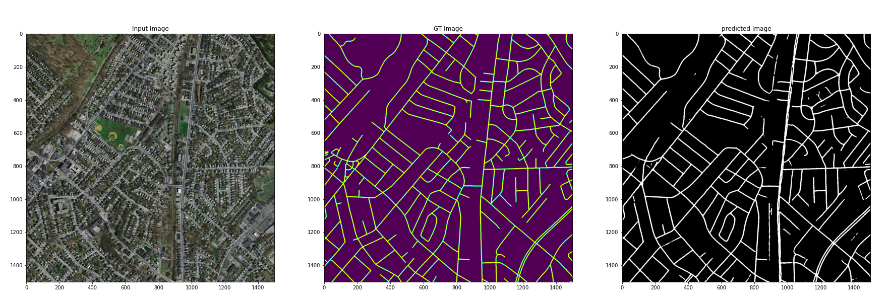

# Satellite-Image-Segmentation
DataSet:  https://www.kaggle.com/insaff/massachusetts-roads-dataset
Satellite-Image-Segmentation

### Data exploration:
The Data set contains 1500*1500 satellite images and there road masks. Upon analysis we can see few output masks were missing so that can be removed from training process.

### Data preprocesssing:
- crop data into smaller tiles 512*512 px
- clean data where no road mask present (i.e tiles tat have no road masks)
- Data augmentation like shift , rotate, contrast & brightness.

### Training:
For training we have used UNET architecture with efficientNet backbone and used transfered weights from imageNet(https://github.com/qubvel/segmentation_models).
below are some samples and performance metrics

## Performance Metrics:
| Precision% | Recall%  | iou_score |f1-score|
|------------|----------|---------  |--------|
| 74.67      | 74.63    | 0.48      | 64.4   |

# Sample Predictions

